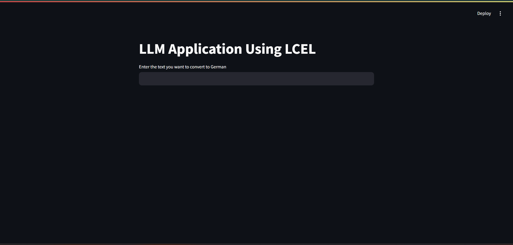

# LLM Application Using LCEL

An end-to-end LLM application built using **LangChain Expression Language (LCEL)**, **LangServe**, **FastAPI**, **Groq API**, and **Streamlit**.

This project exposes a LangChain chain as an API endpoint using LangServe and consumes it through a Streamlit frontend for real-time language translation.

---

## Features

- Build LLM pipelines using **LCEL**
- Deploy chains with **LangServe + FastAPI**
- Use **Groq-hosted LLMs**
- Streamlit frontend
- Real-time translation

---

## Project Structure

```bash
LLM app using LCEL/
│
├── IMAGES/
│   ├── home.png
│   └── IP and OP.png
│
├── client.py
├── serve.py
├── LLM_APP_LCEL.ipynb
├── requirements.txt
├── .env
└── README.md
```

---

## Tech Stack

- Python 3.10
- LangChain
- LCEL
- LangServe
- FastAPI
- Groq API
- Streamlit

---

## Installation

Clone repository:

```bash
git clone <your_repo_url>
cd "LLM app using LCEL"
```

Create virtual environment:

```bash
python -m venv .venv
```

Activate environment:

### Windows
```bash
.venv\Scripts\activate
```

Install dependencies:

```bash
pip install -r requirements.txt
```

---

## Environment Variables

Create `.env` file:

```env
GROQ_API_KEY=your_api_key
LANGCHAIN_API_KEY=your_langsmith_key
LANGCHAIN_TRACING_V2=true
LANGCHAIN_PROJECT=LCEL_App
```

---

## Run Backend

```bash
python serve.py
```

Backend:

```bash
http://127.0.0.1:8000
```

LangServe Playground:

```bash
http://127.0.0.1:8000/chain/playground
```

---

## Run Frontend

Open another terminal:

```bash
streamlit run client.py
```

Frontend:

```bash
http://localhost:8501
```

---

## Screenshots

### Home Page


### Input and Output


---

## Example

Input:

```text
Hello people, how are you?
```

Output:

```text
Hallo Leute, wie geht es euch?
```

---

## Learning Outcomes

This project helped me understand:

- LCEL chaining
- LangServe deployment
- FastAPI integration
- Streamlit frontend
- API-based LLM workflow